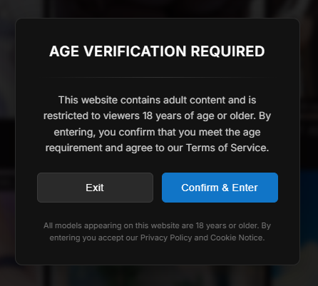

# Age Gate 

A WordPress plugin that displays a customizable **18+ age verification popup** based on the visitor's country.  
It can also **block access entirely** for selected countries, showing an alternative URL instead.

## Features

- Country-based popup display (select which countries will see the age verification).
- Full site blocking for restricted countries with redirect to alternative URL.
- Fully customizable texts and colors from the WordPress admin panel.
- Customizable "Exit" button URL.
- Option to remember user confirmation using **sessionStorage** or **localStorage** for a set number of hours.
- Supports Cloudflare's `/cdn-cgi/trace` for geolocation and `HTTP_CF_IPCOUNTRY` header for faster detection.
- Settings link directly from the Plugins page.
- Developer/company link displayed in the plugin list.

  
  

